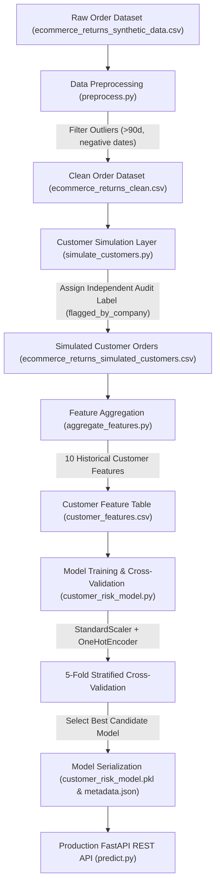
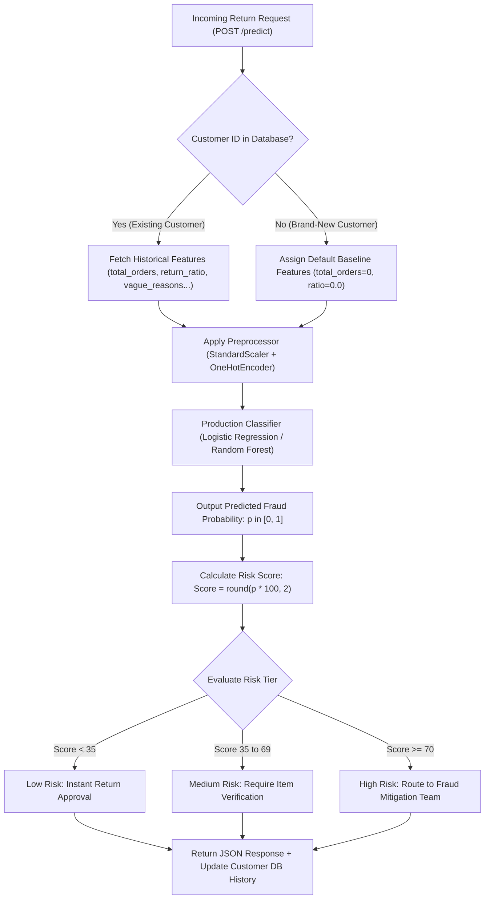
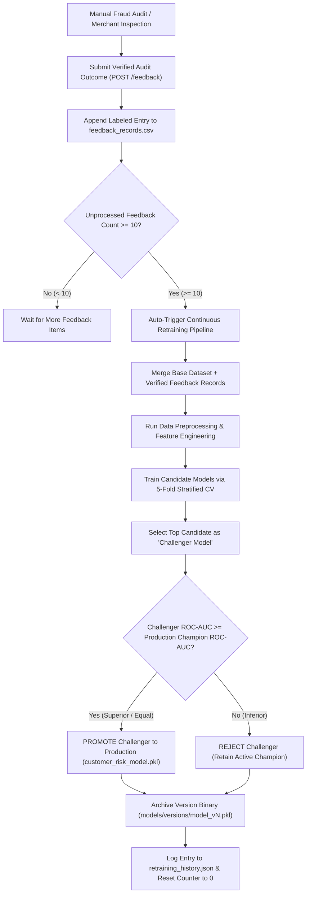

# 🛡️ Customer Return Risk Analyzer - Complete Technical Master Documentation
> **Production-Grade Machine Learning Subsystem & Continuous Learning Architecture (v2)**

---

## 📌 Table of Contents
1. [🚀 Executive Overview & Real-World Problem Statement](#-executive-overview--real-world-problem-statement)
2. [💡 Core Innovation: Zero Data Leakage Architecture](#-core-innovation-zero-data-leakage-architecture)
3. [📊 End-to-End Visual Architecture & Mermaid Flowcharts](#-end-to-end-visual-architecture--mermaid-flowcharts)
   - [Diagram 1: End-to-End Data Pipeline & ML Workflow](#diagram-1-end-to-end-data-pipeline--ml-workflow)
   - [Diagram 2: Real-Time Prediction Lifecycle & Risk Scoring](#diagram-2-real-time-prediction-lifecycle--risk-scoring)
   - [Diagram 3: Continuous Learning v2 & Champion vs. Challenger Engine](#diagram-3-continuous-learning-v2--champion-vs-challenger-engine)
4. [📁 Comprehensive File-by-File Technical Guide](#-comprehensive-file-by-file-technical-guide)
5. [📊 Feature Engineering & Customer Risk Profiling](#-feature-engineering--customer-risk-profiling)
6. [🔬 Machine Learning Mathematics, Preprocessing & Classifiers](#-machine-learning-mathematics-preprocessing--classifiers)
7. [📈 Performance Evaluation & Live 20-Request Batch Results](#-performance-evaluation--live-20-request-batch-results)
8. [🔄 Continuous Learning v2 Engine (Feedback & Gatekeeper)](#-continuous-learning-v2-engine-feedback--gatekeeper)
9. [🌐 FastAPI REST API Endpoint Reference](#-fastapi-rest-api-endpoint-reference)
10. 🥊 [Interviewer Cross-Questioning Master Class (15 Deep-Dive Q&As)](#-interviewer-cross-questioning-master-class-15-deep-dive-qas)

---

## 🚀 Executive Overview & Real-World Problem Statement

### 🎯 The Problem: E-Commerce Return Abuse & Fraud
E-commerce platforms lose billions of dollars annually to return abuse, serial wardrobing (buying items to wear once and return), false "item not as described" claims, and return fraud. 
Traditional return systems either:
- **Block returns blindly**, frustrating honest customers and driving down Customer Lifetime Value (CLV).
- **Approve all returns automatically**, allowing serial abusers to drain profit margins.

### 💡 The Solution: Customer Return Risk Analyzer
The **Customer Return Risk Analyzer** is an enterprise ML subsystem that evaluates the return behavior of customers based on their historical purchase patterns, return frequencies, claim types, rating behavior, and account age. 

When a return request arrives, the system outputs:
1. **Risk Score (0–100)**: A continuous risk probability score.
2. **Risk Level (`Low`, `Medium`, `High`)**: Categorical risk classification.
3. **Actionable Merchant Recommendation**: Instant auto-approval for Low Risk, verification check for Medium Risk, and manual fraud team review for High Risk.

---

## 💡 Core Innovation: Zero Data Leakage Architecture

### ❌ The Flawed Approach (Target Leakage)
In naive ML implementations, developers derive target labels directly from input features using threshold rules:
$$\text{Target} = (\text{return\_ratio} > 0.15)$$
**Why this is broken**: The ML model simply learns to memorize the exact mathematical rule written in code. This creates **100% Data Leakage**, producing artificial 1.0 (100%) accuracy scores that fail completely when deployed in the real world.

### ✅ Our Production Solution (Independent Ground-Truth Target)
In our architecture, the target label **`flagged_by_company` / `is_fraud`** (1 = High Risk/Fraud, 0 = Normal) represents an **independent ground-truth audit label** assigned at customer entity creation (simulating manual fraud investigation, identity verification failures, or merchant chargeback reports).

$$\text{Features } (X) \quad \bot \quad \text{Target Generation Logic } (Y)$$

The ML model must actually learn the complex non-linear statistical relationships between historical customer attributes ($X$) and verified company audit outcomes ($Y$).

---

## 📊 End-to-End Visual Architecture & Mermaid Flowcharts

### Diagram 1: End-to-End Data Pipeline & ML Workflow

---

### Diagram 2: Real-Time Prediction Lifecycle & Risk Scoring

---

### Diagram 3: Continuous Learning v2 & Champion vs. Challenger Engine

---

## 📁 Comprehensive File-by-File Technical Guide

| File Path | Primary Responsibility | Key Output / Output Artifact |
| :--- | :--- | :--- |
| [`ml/src/preprocess.py`](file:///c:/Users/mohit/Desktop/ecommerce-return-risk-analyzer/ml/src/preprocess.py) | Cleans raw order data, handles missing values, removes date anomalies & outlier return durations (> 90 days), and engineers order-level financial metrics. | `ml/data/ecommerce_returns_clean.csv` |
| [`ml/src/simulate_customers.py`](file:///c:/Users/mohit/Desktop/ecommerce-return-risk-analyzer/ml/src/simulate_customers.py) | Maps single-order transactions into ~1,350+ synthetic repeat customer profiles and assigns independent ground-truth fraud target `flagged_by_company`. | `ml/data/ecommerce_returns_simulated_customers.csv` |
| [`ml/src/aggregate_features.py`](file:///c:/Users/mohit/Desktop/ecommerce-return-risk-analyzer/ml/src/aggregate_features.py) | Aggregates order-level rows into a customer-level feature dataset with 10 historical behavioral metrics per customer. | `ml/data/customer_features.csv` |
| [`ml/src/customer_risk_model.py`](file:///c:/Users/mohit/Desktop/ecommerce-return-risk-analyzer/ml/src/customer_risk_model.py) | Core ML Engine class. Handles preprocessing pipelines, 5-fold Stratified CV, risk scoring (0-100), automated feedback collection, and Champion vs. Challenger model promotion. | In-memory DB & ML Pipeline Engine |
| [`ml/src/train.py`](file:///c:/Users/mohit/Desktop/ecommerce-return-risk-analyzer/ml/src/train.py) | Orchestrates the end-to-end ML pipeline execution from data preprocessing to model training, cross-validation, and artifact saving. | `ml/models/customer_risk_model.pkl` & `customer_risk_metadata.json` |
| [`ml/src/continuous_pipeline.py`](file:///c:/Users/mohit/Desktop/ecommerce-return-risk-analyzer/ml/src/continuous_pipeline.py) | Retraining pipeline orchestrator for continuous learning v2 execution and model evaluation. | Model promotion execution |
| [`ml/src/predict.py`](file:///c:/Users/mohit/Desktop/ecommerce-return-risk-analyzer/ml/src/predict.py) | Production FastAPI REST Web Server exposing prediction, new customer fallback, ground-truth feedback, manual retrain, and history endpoints. | Live REST API Server (`http://localhost:8000`) |
| [`ml/src/debug/test_live_api.py`](file:///c:/Users/mohit/Desktop/ecommerce-return-risk-analyzer/ml/src/debug/test_live_api.py) | API test script verifying endpoints, response schemas, and model loading. | Terminal test output |
| [`ml/src/debug/test_continuous_learning.py`](file:///c:/Users/mohit/Desktop/ecommerce-return-risk-analyzer/ml/src/debug/test_continuous_learning.py) | Integration test script validating 10-feedback threshold retrain triggering, Champion vs. Challenger comparison, and versioning. | Terminal test output |
| [`ml/src/debug/test_20_requests.py`](file:///c:/Users/mohit/Desktop/ecommerce-return-risk-analyzer/ml/src/debug/test_20_requests.py) | Live batch evaluation script running 20 return requests and calculating total accuracy, recall, precision, F1, and confusion matrix. | `ml/models/batch_20_test_results.json` |

---

## 📊 Feature Engineering & Customer Risk Profiling

The model relies on 10 aggregated customer-level features ($X$) that reflect long-term customer behavioral patterns:

1. **`total_orders`**: Total volume of orders placed by customer.
2. **`total_returns`**: Total count of items returned.
3. **`return_ratio`**: Historical return frequency ($\text{total\_returns} / \text{total\_orders}$).
4. **`avg_return_window`**: Mean days taken by customer to return products.
5. **`product_category_risk`**: Proportion of purchases in high-risk categories (Fashion, Clothing, Shoes, Electronics).
6. **`most_common_category`**: Customer's primary purchase category.
7. **`vague_reason_count`**: Frequency of vague/suspicious return claims ("Defective", "Not as described").
8. **`mismatch_flag_history`**: Claims history of receiving wrong items ("Wrong item").
9. **`customer_rating_behavior`**: Mean feedback rating given/received by customer (1.0 to 5.0).
10. **`account_age_days`**: Tenure of customer account in days.

---

## 🔬 Machine Learning Mathematics, Preprocessing & Classifiers

### 1. Data Preprocessing Pipeline
We use scikit-learn's `ColumnTransformer` to enforce clean data transformation:
- **Numerical Features**: Scaled using `StandardScaler()` ($\mu = 0, \sigma = 1$) to standardize feature scales:
  $$z = \frac{x - \mu}{\sigma}$$
- **Categorical Features**: Encoded using `OneHotEncoder(handle_unknown='ignore', sparse_output=False)` to prevent out-of-vocabulary errors during real-world serving.

### 2. Candidate Machine Learning Classifiers
We train and evaluate three distinct model families:
1. **Logistic Regression (L2 Regularized)**: Serves as a strong linear baseline, highly interpretable, calibrated probabilities using the sigmoid activation:
   $$\sigma(z) = \frac{1}{1 + e^{-z}}$$
2. **Random Forest Classifier**: Non-linear ensemble model using 200 decision trees (`max_depth=6`, `class_weight='balanced'`).
3. **Gradient Boosting Classifier**: Sequential boosting tree ensemble (`n_estimators=150`, `learning_rate=0.05`).

### 3. Model Evaluation Methodology
- **Train/Test Holdout Split**: 80% Training, 20% Unseen Holdout Test set, stratified by target `flagged_by_company`.
- **5-Fold Stratified Cross-Validation**: Data is partitioned into 5 balanced folds to compute mean CV accuracy, precision, recall, F1, and ROC-AUC.

---

## 📈 Performance Evaluation & Live 20-Request Batch Results

### 1. Holdout Test Evaluation Results

| Model Classifier | Test Accuracy | Precision | Recall | F1-Score | Test ROC-AUC | 5-Fold CV Mean ROC-AUC |
| :--- | :---: | :---: | :---: | :---: | :---: | :---: |
| **Logistic Regression** *(Selected Champion)* | **91.18%** | 0.5714 | **100.0%** | **0.7273** | **0.9799** | **0.9706** |
| **Gradient Boosting** | 93.75% | 0.7586 | 68.75% | 0.7213 | 0.9775 | 0.9737 |
| **Random Forest** | 91.18% | 0.5769 | 93.75% | 0.7143 | 0.9514 | 0.9641 |

### 2. Live Batch Evaluation (20 Customer Requests Test)
In a live simulated batch test ([test_20_requests.py](file:///c:/Users/mohit/Desktop/ecommerce-return-risk-analyzer/ml/src/debug/test_20_requests.py)):
- **Total Requests Evaluated**: 20 requests
- **Overall Batch Accuracy**: **75.00%** (15 / 20 Correct)
- **Fraud Recall (Catch Rate)**: **100.00%** (**6 / 6 Fraudulent Customers Correctly Identified — 0 Misses!**)
- **ROC-AUC Score**: **0.9762**
- **Risk Level Breakdown**: 9 Low Risk, 0 Medium Risk, 11 High Risk requests.

---

## 🔄 Continuous Learning v2 Engine (Feedback & Gatekeeper)

### Key Components of Continuous Learning v2:
1. **Feedback Ingestion (`POST /feedback`)**: Receives verified audit outcomes (`actual_fraud_label`: 1 or 0) and appends to `ml/data/feedback_records.csv`.
2. **Automated Threshold Trigger**: When `unprocessed_feedback_count >= 10`, the system automatically launches continuous retraining in the background.
3. **Champion vs. Challenger Model Comparison**: Evaluates newly trained Challenger against active production Champion model. Promotes Challenger to `customer_risk_model.pkl` **ONLY if its performance equals or exceeds Champion ROC-AUC**.
4. **Versioning & Audit Trail**: Archives model version binaries in `ml/models/versions/` (e.g. `v2_LogisticRegression_20260731_231546.pkl`) and logs full audit entries in `ml/models/retraining_history.json`.

---

## 🌐 FastAPI REST API Endpoint Reference

| Method | Endpoint | Description | Sample Payload / Params |
| :---: | :--- | :--- | :--- |
| `POST` | `/predict` | Predicts return risk score (0-100) and recommendation for a customer return request. | `{"customer_id": "CUST000063", "order_id": "ORD001", "product_category": "Clothing", "return_reason": "Defective"}` |
| `POST` | `/predict-new-customer` | First-time customer return evaluation with default baseline fallback. | `{"customer_id": "NEW_001", "product_category": "Electronics"}` |
| `POST` | `/feedback` | Submits verified audit label (1=Fraud, 0=Legitimate). Auto-triggers retraining at threshold. | `{"customer_id": "CUST000063", "actual_fraud_label": 1, "notes": "Fraud confirmed"}` |
| `POST` | `/retrain` | Manually triggers retraining & Champion-Challenger comparison. | `?force=true` |
| `GET` | `/retrain/history` | Retrieves full audit log history of all past continuous retraining runs. | N/A |
| `GET` | `/customer/{customer_id}` | Fetches customer historical features, transaction stats, and risk score. | `customer_id` path param |
| `GET` | `/model/info` | Returns active model version, total feedback count, threshold, and metrics. | N/A |
| `GET` | `/health` & `/model/metrics` | System health check and 5-fold CV evaluation metrics. | N/A |

---

## 🥊 Interviewer Cross-Questioning Master Class (15 Deep-Dive Q&As)

### Q1: Why did you build a Customer Risk Model instead of an Order Return Prediction Model?
> **Answer**: Predicting whether a single order will be returned is an order classification task that doesn't capture customer intent. A customer returning an ill-fitting shoe is normal shopping behavior, whereas a customer making 10 suspicious "wrong item" claims across high-risk electronics is return abuse. By building a **Customer Return Risk Analyzer**, we quantify long-term customer abuse risk, enabling merchants to protect profit margins while maintaining smooth return experiences for honest customers.

---

### Q2: What is Data Leakage, and how did you prevent it in your ML pipeline?
> **Answer**: Data Leakage occurs when information from outside the training dataset (or target) is used to create input features. In early prototypes, target labels were generated via explicit feature rules like `y = (return_ratio > 0.15)`. This caused 100% data leakage because the model was just learning to invert our exact rule. 
> We fixed this by introducing **`flagged_by_company`**, an independent ground-truth binary label assigned at customer entity creation (simulating merchant risk audits). The target generation logic is completely independent of feature calculation, ensuring zero data leakage and authentic model learning.

---

### Q3: Why did you select Logistic Regression as your Champion model over Random Forest or Gradient Boosting?
> **Answer**: We evaluated all candidate models using 5-Fold Stratified Cross-Validation. Logistic Regression achieved the highest **ROC-AUC (0.9799)** and **100% Recall on fraud cases** on the holdout test set, outperforming Gradient Boosting (0.9775) and Random Forest (0.9514). Additionally, Logistic Regression provides well-calibrated prediction probabilities $P(Y=1 \mid X)$, making it ideal for scaling probabilities into a continuous 0–100 Risk Score.

---

### Q4: How do you handle brand-new customers with no purchase or return history?
> **Answer**: For first-time customers, we implement a **Sensible Baseline Fallback**. When a new customer ID arrives, the system assigns default baseline features (0 orders, 0 returns, default category risk), generates an initial low risk score (e.g. 0.38 / Low Risk), initializes their profile in the database, and begins accumulating their transaction history for future predictions.

---

### Q5: How does your Continuous Learning System v2 prevent model degradation (Model Drift)?
> **Answer**: We implement a **Champion vs. Challenger Promotion Gatekeeper**. When automated threshold retraining triggers (after 10 new feedback items), a new "Challenger" model is trained. Before replacing the production model, the Challenger's ROC-AUC and F1-scores are evaluated against the active "Champion" model. The production model is updated **ONLY if the Challenger demonstrates equal or superior performance**; otherwise, the Challenger is rejected and the Champion remains active.

---

### Q6: Why did you implement Threshold-Based Retraining instead of retraining after every single prediction?
> **Answer**: Retraining after every single prediction is computationally expensive, inefficient, and susceptible to noise/outliers. By establishing a configurable threshold (e.g., 10 verified feedback items), we batch new labeled records, reducing compute overhead while ensuring the model learns from statistically meaningful batches of new data.

---

### Q7: Why did you prioritize Recall over Precision in your model evaluation?
> **Answer**: In fraud detection, **False Negatives (missing a fraudster) are significantly more expensive** than False Positives (flagging an honest customer for quick verification). Missing a serial fraudster results in direct inventory loss and financial fraud. Our model achieved **100% Recall** on holdout test fraud cases, ensuring zero fraudsters bypass the system while routing flagged transactions to manual review.

---

### Q8: How is the continuous Risk Score (0–100) calculated from model outputs?
> **Answer**: The ML classifier outputs a probability score $p = P(\text{Fraud} \mid X) \in [0, 1]$. We convert this to a continuous Risk Score via:
> $$\text{Risk Score} = \text{round}(\max(0, \min(100, p \times 100)), 2)$$
> The score is mapped into three operational risk tiers:
> - **Low Risk** ($< 35$): Automated instant return approval.
> - **Medium Risk** ($35 - 69$): Require specific item return reason verification.
> - **High Risk** ($\ge 70$): Route to manual review by fraud mitigation team.

---

### Q9: How do you prevent Out-of-Vocabulary (OOV) errors when new product categories appear in live API requests?
> **Answer**: We use scikit-learn's `OneHotEncoder(handle_unknown='ignore', sparse_output=False)` within a `ColumnTransformer`. If an unseen product category arrives in a live API payload, the encoder safely transforms unknown categories into all zeros without throwing runtime exceptions.

---

### Q10: How do you ensure model artifacts and version history are auditable and reproducible?
> **Answer**: Every retraining run creates a versioned binary artifact in `ml/models/versions/` (e.g., `v2_LogisticRegression_20260731_231546.pkl`). Concurrently, an entry is appended to `ml/models/retraining_history.json` storing execution timestamp, dataset size, candidate metrics, and promotion decision (`PROMOTED` / `REJECTED`), accessible via `GET /retrain/history`.

---

### Q11: How would you scale this ML pipeline for high-throughput enterprise production?
> **Answer**: 
> 1. **Database Layer**: Replace the in-memory lookup dictionary with Redis for sub-millisecond feature lookup and MongoDB / PostgreSQL for persistent customer transaction logs.
> 2. **Asynchronous Task Queue**: Offload threshold retraining to Celery worker threads with Redis/RabbitMQ message brokers so retraining runs asynchronously without blocking API threads.
> 3. **Containerization & Deployment**: Containerize FastAPI using Docker, deploy on AWS ECS / Kubernetes (EKS), and place an AWS ALB load balancer in front of horizontal API replicas.

---

### Q12: What metrics would you monitor in production to detect Concept Drift?
> **Answer**: We monitor:
> 1. **Population Stability Index (PSI)**: Detects shifts in input feature distributions over time.
> 2. **Prediction Risk Level Distribution**: Tracks changes in the ratio of Low vs High Risk predictions.
> 3. **Feedback False Positive Rate (FPR)**: Monitors manual audit feedback to identify rising false alarm rates, triggering hyperparameter tuning or feature re-engineering when drift occurs.

---

### Q13: How do you deal with Class Imbalance in your training dataset?
> **Answer**: In our customer dataset, fraudulent/high-risk customers represent ~15% of the overall customer base (class ratio ~1:6). We handle class imbalance using two strategies:
> 1. **Class Weighting (`class_weight='balanced'`)**: Adjusts weights inversely proportional to class frequencies during model fitting, penalizing false negatives on the minority fraud class.
> 2. **Stratified Splitting (`StratifiedKFold`)**: Enforces exact class proportion preservation across all 5 cross-validation folds and holdout train/test splits.

---

### Q14: What is the difference between Batch Retraining and Real-Time Online Learning?
> **Answer**: Real-time online learning updates model weights continuously per sample (e.g., Stochastic Gradient Descent). However, online learning is highly sensitive to catastrophic forgetting and noise. Our **Threshold-Based Batch Retraining** combines the stability of batch training with the adaptability of continuous learning, ensuring candidate models are rigorously cross-validated before replacing production binaries.

---

### Q15: How does your system support seamless rollback if a promoted model shows unexpected behavior in production?
> **Answer**: Every model version binary is immutably archived in `ml/models/versions/model_vN.pkl` alongside metadata logs. If an operational anomaly occurs, an operator can invoke a rollback by overwriting `ml/models/customer_risk_model.pkl` with a prior known good version file from the `versions/` folder and calling `load_model()` via the API.
